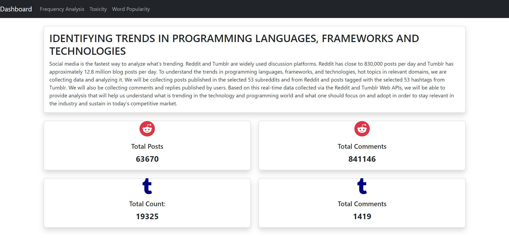
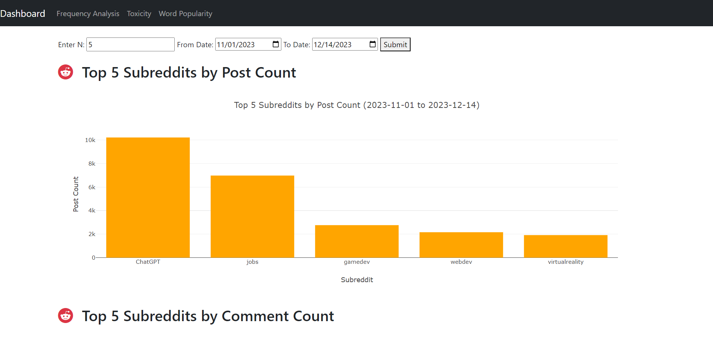
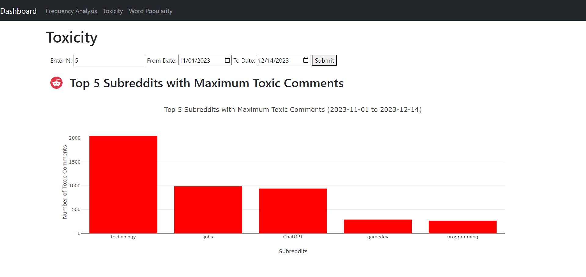
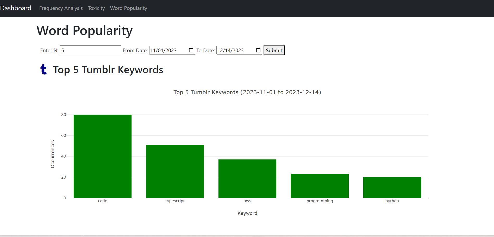

**Project Title:** IDENTIFYING TRENDS IN PROGRAMMING LANGUAGES, FRAMEWORKS AND TECHNOLOGIES

**Abstract :** 
Social media is the fastest way to analyze what’s trending. Reddit
and Tumblr are widely used discussion platforms. Reddit has close
to 830,000 posts per day and Tumblr has approximately 12.8 million
blog posts daily. To understand the trends in programming languages, 
frameworks and technologies, and hot topics in relevant domains,
we have collected data in the form of posts and comments and analyzed them. 
We have processed and analyzed the real-time data collected via Reddit and 
TumblrWeb APIs. 

**Web Application:**
We have developed a Web Application to visualize these analyses. The navbar 
at the top provides links to the Dashboard, the Frequency Analysis page, 
the Word Popularity page, and the Toxicity Analysis page. The Dashboard 
provides real-time counts of the total number of posts and comments 
from Reddit and Tumblr. The Frequency Analysis page visualizes the top 
subreddits and hashtags by the number of posts and comments. The Word Popularity
Page graphically represents the top keywords on Reddit and Tumblr, and the 
word clouds for Reddit and Tumblr. The Toxicity Analysis page displays the 
subreddits with the maximum number of toxic comments and their trends of 
toxicity analysis. The Frequency Analysis page, the Word Popularity page, and 
the Toxicity Analysis page each provide interactive querying and results to 
users in the form of the ability to choose the value of N (number used in the 
particular analysis) and the Date Range used for analysis.

**Project Tech Stack** 

**Programming Language:**  
Python Version 3.11.4. Refer [Python Documentation](https://www.python.org/)

**Web Framework:**  
Flask Version 3.0.0. It is a lightweight and popular web application framework. Refer [Flask Documentation](https://github.com/pallets/flask)

**Front End Development:**  
Bootstrap: Version 5.3.2. It is a free and open-source CSS framework that contains HTML, CSS, and JavaScript-based design templates Refer: [Bootstrap Documentation](https://getbootstrap.com/)  
HTML 5 Refer [HTML Documentation](https://developer.mozilla.org/en-US/docs/Web/HTML)   
JavaScript Refer [JavaScript Documentation](https://developer.mozilla.org/en-US/docs/Web/JavaScript)

**Database:**  
PostgreSQL Version 15.5. It is a free and open-source RDBMS. Refer [PostgreSQL Documentation](https://www.postgresql.org/) 

**Libraries:**  
psycopg2 Version 2.9.5. It is the most popular PostgreSQL database adapter for the Python programming language. Refer: [Psycopg2 Documentation](https://pypi.org/project/psycopg2/)  
Plotly It is an interactive graphical library for Python. Refer [Plotly Documentation](https://github.com/plotly/plotly.py)

**Steps for execution:**  
1. Login to the VM  
2. Open up a new terminal window  
3. Activate the virtual environment by running the command:   
**source WestSideTech/venv/bin/activate**    
4. Navigate to the project directory by running the command: 
**cd WestSideTech/venv/crawler/**  
5. Run the command: **python app.py** to launch the web application 
6. The Web application starts running at http://127.0.0.1:5000. Open this URL in the browser. 
7. This loads the Dashboard page. This page displays the abstract of the project and the real time counts of posts and comments collected from Reddit and Tumblr.  The navbar at the top displays links to different pages

8. Clicking on the Frequency Analysis link opens up the Frequency Analysis Page. This Page displays four bar graphs depicting the top N subreddits and top N hashtags by posts count and comments count for a given date range. It allows users to change the value of N and the value of date range and displays dynamically. All these graphs provide interactive options like zoom in, zoom out, download options, and so on. 

9. Clicking on the Toxicity link opens up the Toxicity Page. This Page displays a bar graph displaying the Top N Subreddits with Maximum Toxic Comments and a line plot displaying the trend of toxicity in these subreddits for the given date range. It allows users to change the value of N and the value of date range and displays dynamically. All these graphs provide interactive options like zoom in, zoom out, download options, and so on. 

10. Clicking on the Word Popularity link opens up this Page. This Page displays bar graphs displaying the Top N  keywords from Reddit and Tumblr in the given date range and the word clouds for Reddit and Tumblr. It allows users to change the value of N and the value of date range and displays dynamically. All these graphs provide interactive options like zoom in, zoom out, download options, and so on. 

